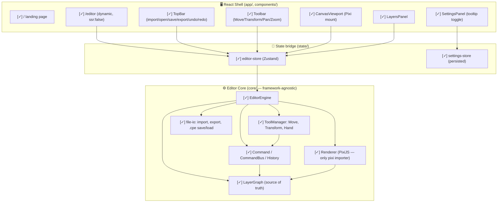

# App architecture graph

Status: [ ] planned | [~] in progress | [✓] built | [✓✓] reviewed | [⚠] issue

Last updated: 2026-07-17 11:50
Phase: Build (Phase 1 — MVP core loop)

## Architecture

## Component changelog
| Date/Time | Component | Status | By |
|-----------|-----------|--------|-----|
| 2026-07-17 11:50 | Editor Core (all modules) | [✓] built | builder |
| 2026-07-17 11:50 | React shell + stores | [✓] built | builder |
| 2026-07-17 11:50 | Landing + editor pages | [✓] built | builder |

## Open issues
| Date/Time | Issue | Status | Owner |
|-----------|-------|--------|-------|
| 2026-07-17 11:50 | Transform tool mutates graph transiently during drag (rewound + committed as one Command on release) — acceptable for MVP, revisit for a preview-only channel | open | builder |
| 2026-07-17 11:50 | Layer thumbnails not yet shown in LayersPanel | open | builder |
| 2026-07-17 11:50 | Cut/Copy/Paste + Selection tool not yet implemented (Phase 1 remainder) | open | builder |
